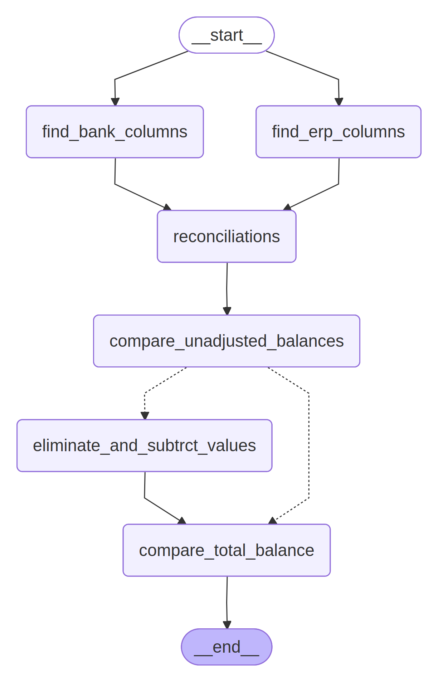

# Bank Reconciliation Agent 🏦

An intelligent AI-powered bank reconciliation system that automatically matches and reconciles bank statements with ERP data using LangGraph workflows and LLM-based analysis.



## 🚀 Key Features

- **AI-Powered Column Detection**: Automatically identifies transaction date, debit, and credit columns in both bank and ERP files
- **Intelligent Reconciliation**: Uses LLM to generate dynamic Python code for balance calculations
- **Multi-Format Support**: Handles CSV files for bank data and ODS files for ERP data
- **Automated Matching**: Performs one-to-one transaction matching and elimination
- **RESTful API**: FastAPI-based web service with CORS support
- **LangGraph Workflow**: Structured agent workflow for reliable processing
- **Error Handling**: Robust fallback mechanisms and error recovery

## 🛠️ Installation

```bash
# Clone the repository
git clone https://github.com/Bikas0/Bank-Reconciliations.git
cd Bank-Reconciliations

# Install dependencies
pip install -r Bikas/requirements.txt
```

## ⚙️ Environment Setup

Create a `.env` file in the Bikas directory with your Groq API key:

```env
GROQ_API_KEY=your_groq_api_key_here
```

## 🚀 Usage

### Start the API Server
```bash
cd Bikas
python app.py
```

The API will be available at `http://localhost:8000`

### Upload Files for Reconciliation
```bash
curl -X POST "http://localhost:8000/reconcile" \
     -H "accept: application/json" \
     -H "Content-Type: multipart/form-data" \
     -F "bank_file=@bank_statement.csv" \
     -F "erp_file=@erp_data.ods"
```

## 📁 Project Structure

```
.
├── Bikas
│   ├── app.py                     # FastAPI web server
│   ├── bankReconciliationAgent.py # Main reconciliation workflow
│   ├── Datasets                   # Sample data files
│   │   ├── Pubali # 41774.csv
│   │   ├── Pubali # 41774-ERP.csv
│   │   └── Pubali # 41774-ERP.ods
│   ├── erp_ods_to_csv.py          # ODS to CSV converter
│   └── requirements.txt           # Python dependencies
├── LICENSE
├── main.ipynb
├── README.md
└── Workflow.png
```

## 🔧 Core Components

### 1. **FastAPI Web Server** (`app.py`)
- Handles file uploads for bank CSV and ERP ODS files
- Processes reconciliation requests through the agent workflow
- Returns structured JSON responses with reconciliation results
- Includes CORS middleware for frontend integration

### 2. **Bank Reconciliation Agent** (`bankReconciliationAgent.py`)
- **LangGraph Workflow**: Structured multi-step reconciliation process
- **AI Column Detection**: Uses Groq LLM to identify relevant columns
- **Dynamic Balance Calculation**: LLM generates Python code for calculations
- **Transaction Matching**: Automated matching and elimination of transactions
- **State Management**: Tracks reconciliation progress through Pydantic models

### 3. **ERP Data Converter** (`erp_ods_to_csv.py`)
- Converts ODS files to CSV format
- Extracts specific columns: Document No, Date, Partner, Activity, Description, Debit, Credit
- Handles data cleaning and validation
- Filters out invalid or empty records

## 🔄 Reconciliation Workflow

The system follows a structured workflow using LangGraph:

1. **Column Detection**: AI identifies transaction date, debit, and credit columns in both datasets
2. **Balance Calculation**: LLM generates Python code to calculate net balances
3. **Initial Comparison**: Compares unadjusted balances between bank and ERP
4. **Transaction Matching**: Performs one-to-one matching and elimination
5. **Final Reconciliation**: Calculates adjusted balances and differences

## 📊 API Response Format

```json
[
  {
    "Status": true,
    "Message": "Reconciliation completed successfully",
    "Data": {
      "unadjusted_erp_balance": 150000.0,
      "unadjusted_bank_balance": 148500.0,
      "adjusted_bank_balance": 149750.0,
      "adjusted_erp_balance": 149750.0,
      "amount_difference": 0.0,
      "response": "The ERP balance is 149750.0 and the bank balance is 149750.0; both are equal."
    }
  }
]
```

## 🎯 Key Features Explained

### AI-Powered Column Detection
The system uses Groq's Gemma2-9B model to automatically identify column names in uploaded files, eliminating the need for manual column mapping.

### Dynamic Code Generation
The LLM generates Python code for balance calculations, adapting to different data formats and column structures automatically.

### Intelligent Matching
The reconciliation engine performs sophisticated transaction matching, identifying and eliminating matching entries between bank and ERP data.

### Robust Error Handling
Includes fallback mechanisms for calculation failures and comprehensive error reporting.

## 🔧 Configuration

### Model Configuration
- **LLM Model**: Groq Gemma2-9B-IT
- **Temperature**: 0 (deterministic output)
- **Max Retries**: 2
- **Recursion Limit**: 100

### File Processing
- **Upload Directory**: `Datasets/`
- **Supported Formats**: CSV (bank), ODS (ERP)
- **Auto-cleanup**: Temporary files are managed automatically

## 🚨 Troubleshooting

### Common Issues

**File Format Errors**
- Ensure bank files are in CSV format
- Ensure ERP files are in ODS format
- Check that files contain the required columns

**API Key Issues**
- Verify your Groq API key is set in the `.env` file
- Check API key permissions and rate limits

**Column Detection Failures**
- Ensure your data files have clear column headers
- Check that debit/credit columns contain numeric data
- Verify date columns are properly formatted

### Performance Optimization
- Use smaller sample files for testing
- Monitor API rate limits for the Groq service
- Consider caching results for repeated reconciliations

## 📈 Sample Data

The project includes sample data files in the `Datasets/` directory:
- `Pubali # 41774.csv`: Sample bank statement data
- `Pubali # 41774-ERP.ods`: Sample ERP transaction data
- `Pubali # 41774-ERP.csv`: Converted ERP data

## 🎉 Benefits

- **Automated Processing**: Eliminates manual reconciliation work
- **AI Intelligence**: Adapts to different data formats automatically
- **Accuracy**: Reduces human error in reconciliation processes
- **Scalability**: Handles large datasets efficiently
- **Integration Ready**: RESTful API for easy system integration

## 🔮 Future Enhancements

- Support for additional file formats (Excel, JSON)
- Advanced matching algorithms for partial transactions
- Real-time reconciliation monitoring
- Batch processing capabilities
- Integration with popular accounting systems
